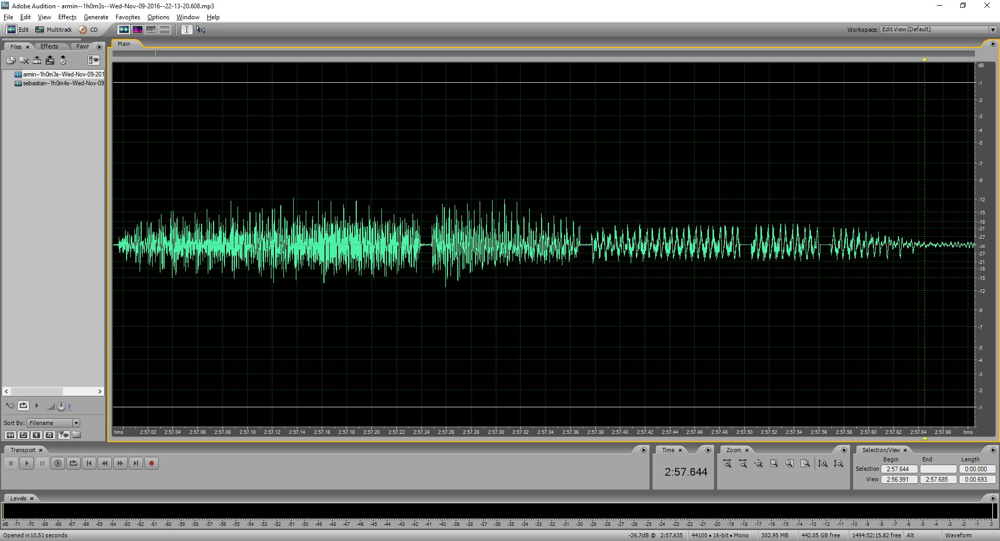

# zencastr Recording Fixer
Sometimes, zencastr messes up your recording and it sounds like [this](example/armin-short.wav). This Python script will try to fix that.

In the waveform, this is what happens:



The short silences you can see, shouldn't be there. This is what messes up the recording

In my case these silences were all 9ms long. If yours are shorter, you will have to use another threshold (see below).

This script tries to remove these silences as good as possible.

## Prerequisites:
The script only works with .wav files. If you did only record the MP3, convert to WAV before using.

## How to use
The script takes 2 parameters: input file (the messed up one) and a destination file. For example:

```bash
./fix-zencastr-recording.py example/armin-short.wav example/armin-fixed.wav
```

If your silences are shorter, let's say 2ms, you can add an optional 3rd parameter:
```bash
./fix-zencastr-recording.py example/armin-short.wav example/armin-fixed.wav 2
```
By default, the script will look for silences of 9ms (+-15%), with the 3rd parameter you can tell it to look for silence of other length.

## Result
The result of the script is another .wav file. Unluckily, I was not able to completely clean up the file, but it will sound (more or less) [like this](example/armin-fixed.wav) afterwards.

## Note
Since every frame is read and written separately, the script takes some time to run.